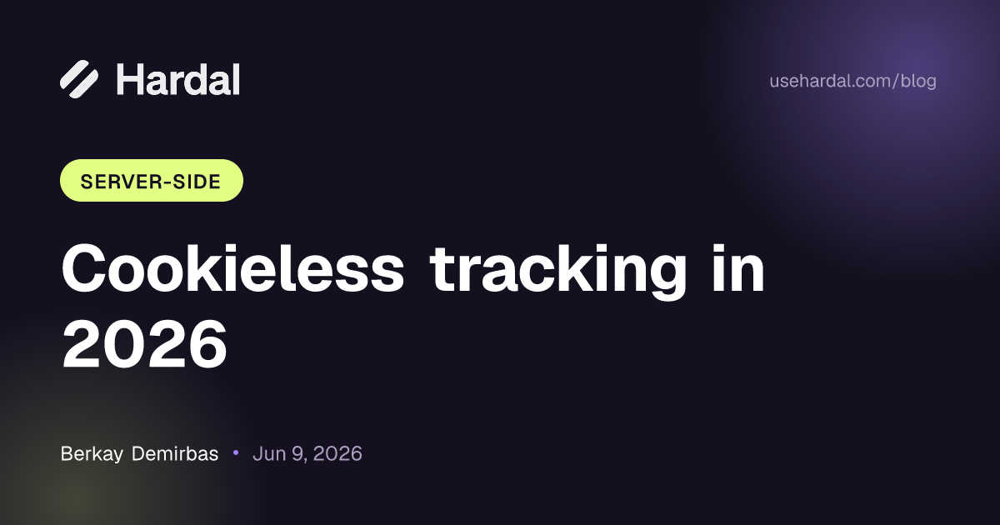

# Hardal OG Image Generator

Generate on-brand **1200×630 Open Graph images** for blog posts — one at a time
or in bulk from a CSV. Every image is also a plain **API endpoint**, so it can be
wired straight into a blog's `<head>` and rendered on demand.



Built for the Hardal Growth Manager case study (Case 2).

---

## What it does

| Requirement | Where it lives |
|---|---|
| Input: title, author, category, date | Form on `/` + query params on `/api/og` |
| Hardal brand colors & font (Geist) | `app/lib/og-template.tsx`, fonts in `app/fonts/` |
| Blog title, category badge, logo, 1200×630 | `app/lib/og-template.tsx` |
| API endpoint for integration | `GET /api/og` (`app/api/og/route.tsx`) |
| Live preview before download | `/` — preview `` points at the live API |
| Bulk generation | CSV upload on `/` |
| CSV upload for batch processing | `papaparse` → rows → previews |
| Export: single or batch ZIP | Download PNG button / "Download all (ZIP)" via `jszip` |
| Deploy on Vercel | Edge route + standard Next.js app |

---

## Tech stack

- **Next.js 14** (App Router) + **TypeScript**
- **`next/og`** (`ImageResponse` / Satori) for image rendering — runs on the **Edge runtime**
- **Tailwind CSS** for the UI
- **papaparse** (CSV) and **jszip** (batch download), both client-side
- **Geist** font bundled in the repo (so deploys are self-contained)

---

## Quick start (local)

```bash
npm install
npm run dev
# open http://localhost:3000
```

Build a production bundle:

```bash
npm run build && npm run start
```

---

## Deploy to Vercel

1. Push this repo to GitHub.
2. On [vercel.com](https://vercel.com) → **Add New… → Project** → import the repo.
3. Framework preset auto-detects **Next.js**. No env vars needed.
4. **Deploy.** The app is live at `https://<your-project>.vercel.app`, and the
   API at `https://<your-project>.vercel.app/api/og`.

---

## The API endpoint

`GET /api/og` returns a PNG (1200×630). All params are optional.

| Param | Example | Default |
|---|---|---|
| `title` | `Cookieless tracking in 2026` | `Untitled post` |
| `author` | `Berkay Demirbas` | *(hidden if empty)* |
| `category` | `Server-side` | `Blog` |
| `date` | `2026-06-09` (ISO is auto-formatted) | *(hidden if empty)* |

**Example**

```
/api/og?title=How%20Meta%20CAPI%20recovers%20conversions&category=Attribution&author=Hardal%20Team&date=2026-04-28
```

**Wire it into a blog post `<head>`**

```html
<meta property="og:image"
  content="https://your-project.vercel.app/api/og?title=Your%20Title&category=Server-side&author=Hardal%20Team&date=2026-06-09" />
<meta name="twitter:card" content="summary_large_image" />
```

Responses are cached (`Cache-Control: immutable, max-age=31536000`) — identical
params always return the identical image, so the CDN serves it without
re-rendering.

---

## Batch / CSV

Upload a CSV with these columns (header row required):

```csv
title,author,category,date
Cookieless tracking: why server-side is the new default,Berkay Demirbas,Server-side,2026-05-12
How Meta CAPI recovers conversions lost to iOS,Baris Gurbuzler,Attribution,2026-04-28
```

A ready-made `public/sample.csv` is included (and downloadable from the UI). The
app renders a preview per row and bundles every image into a single ZIP.

---

## Customization

Everything brand-related is in one file: **`app/lib/og-template.tsx`**.

- **Colors** — the `BRAND` object (navy `#141020`, purple `#A082FF`, green
  `#E1FF82`).
- **Layout / badge / type scale** — the `ogElement()` function.
- **Logo** — the official Hardal logo (white, transparent) is bundled at
  `app/og-assets/hardal-logo.png`. The route loads it and passes it to the
  template; to change it, replace that single PNG (the template falls back to a
  text wordmark if the file is ever missing).
- **Font** — Geist `.ttf` files live in `app/fonts/` and are loaded by both the
  route and the UI.

---

## Project structure

```
app/
  api/og/route.tsx     # GET /api/og — ImageResponse (edge)
  lib/og-template.tsx  # shared image template + brand tokens
  fonts/               # Geist TTFs (bundled)
  og-assets/           # Hardal logo (white, transparent PNG)
  page.tsx             # UI: form, live preview, CSV upload, ZIP export
  layout.tsx           # loads Geist for the UI
  globals.css
public/sample.csv
```

---

## AI assistance

Per the case instructions: this project was built with **Claude (Anthropic)** as
a coding assistant. AI was used to scaffold the Next.js app, draft the
`ImageResponse` template, and write this README. Architecture decisions (edge
runtime, a single shared template for route + preview, bundling Geist for
self-contained deploys) and all the testing/QA are my own, and I can walk
through any part of the code. Files touched with AI assistance carry a header
comment noting it.

---

## With more time

- Add multiple templates (e.g. a different accent color per category).
- Add a webhook / build-time hook so the blog CMS calls `/api/og` automatically
  on publish.
- Server-side ZIP for very large batches instead of client-side fetching.
